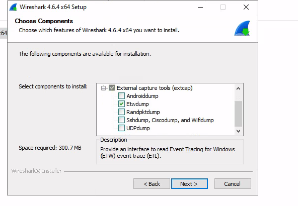
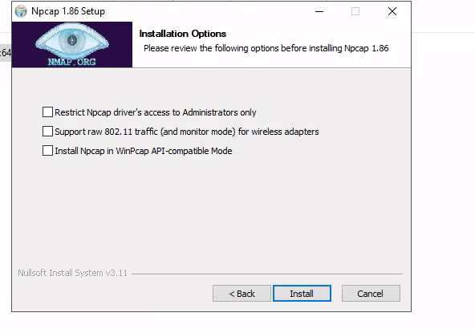
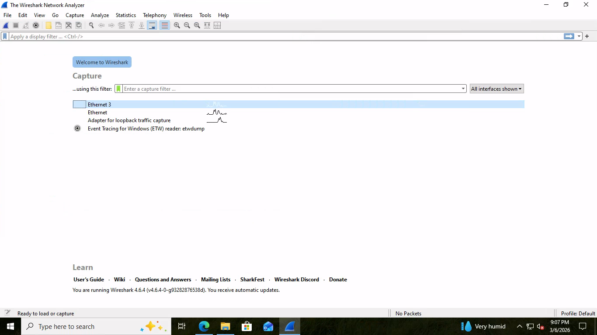
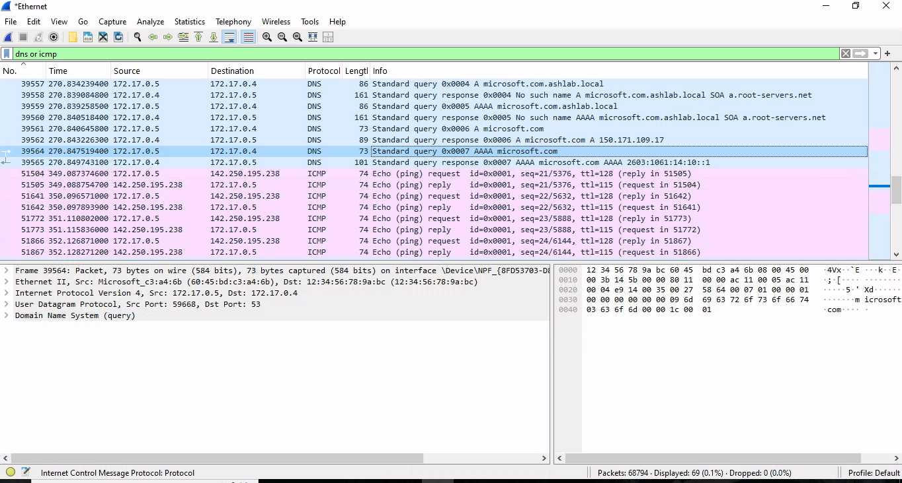

# 🔍 Wireshark Network Traffic Analysis Lab


A hands-on network traffic analysis lab using Wireshark to capture, dissect, and interpret live network communications in a Windows Active Directory environment. Built to develop core SOC Analyst skills including packet analysis, DNS investigation, protocol hierarchy analysis, and PCAP file management.

---

## 📋 Table of Contents

- [Lab Overview](#lab-overview)
- [Environment & Architecture](#environment--architecture)
- [Tools & Technologies](#tools--technologies)
- [Lab Objectives](#lab-objectives)
- [Packet Capture Process](#packet-capture-process)
- [Packet Analysis](#packet-analysis)
- [DNS Traffic Analysis](#dns-traffic-analysis)
- [ICMP Traffic Analysis](#icmp-traffic-analysis)
- [Capture Statistics](#capture-statistics)
- [Protocol Hierarchy Analysis](#protocol-hierarchy-analysis)
- [PCAP File Management](#pcap-file-management)
- [Skills Demonstrated](#skills-demonstrated)
- [Screenshots](#screenshots)

---

## 🧪 Lab Overview

This lab was designed to develop hands-on packet analysis skills by:

- Capturing live network traffic in a Windows Active Directory environment
- Analyzing DNS and ICMP protocols at the packet level
- Identifying network endpoints and communication patterns
- Understanding protocol dissection and packet structure
- Exporting filtered packet captures to simulate incident response workflows

---

## 🖥️ Environment & Architecture

```
┌─────────────────────────────────────────────────────┐
│              AZURE LAB NETWORK                      │
│                                                     │
│  ┌─────────────────┐        ┌───────────────────┐  │
│  │  Windows 10      │───────▶│  Windows Server   │  │
│  │  172.17.0.5      │  DNS   │  172.17.0.4       │  │
│  │  (Client)        │Queries │  (Domain Controller│  │
│  └─────────────────┘        │  + DNS Server)    │  │
│           │                  └───────────────────┘  │
│           │ ICMP                                    │
│           ▼                                         │
│  ┌─────────────────┐                               │
│  │  Google Server   │                               │
│  │  142.250.76.110  │                               │
│  │  (External)      │                               │
│  └─────────────────┘                               │
└─────────────────────────────────────────────────────┘
```

| Machine | IP Address | Role |
|---|---|---|
| Windows 10 | 172.17.0.5 | Client Machine |
| Windows Server | 172.17.0.4 | Domain Controller + DNS Server |
| Google Server | 142.250.76.110 | External Internet Host |

---

## 🛠️ Tools & Technologies

| Category | Tool |
|---|---|
| Packet Capture | Wireshark 4.6 |
| Capture Driver | Npcap |
| Platform | Microsoft Azure Virtual Machines |
| OS | Windows 10, Windows Server |
| Capture Format | PCAPNG |
| Network Interface | Ethernet 3 |

---

## 🎯 Lab Objectives

- Install Wireshark and Npcap packet capture drivers
- Identify active network interfaces
- Capture live network traffic from a Windows endpoint
- Analyze DNS query and response packets
- Analyze ICMP ping traffic
- Review protocol hierarchy statistics
- Identify network endpoints and communication patterns
- Export filtered packet captures in PCAPNG format

---

## 📡 Packet Capture Process

Packet capture was started on the **Ethernet 3 interface**, which showed the highest network activity.

Traffic was generated using the following commands:

```bash
ping google.com
nslookup microsoft.com
```

A display filter was applied to isolate relevant traffic:

```
dns or icmp
```

This filtered the capture to show only DNS queries and ICMP ping traffic for focused analysis.

---

## 🔍 Packet Analysis

Wireshark organizes packet data into three panes:

### Packet List Pane
Displays a summary of each captured packet:

| Field | Description |
|---|---|
| Packet Number | Sequential capture order |
| Timestamp | Time of capture |
| Source IP | Originating host |
| Destination IP | Target host |
| Protocol | Network protocol used |
| Length | Packet size in bytes |
| Info | Human-readable packet summary |

### Packet Details Pane
Displays the full protocol stack of a selected packet:

```
Frame
└── Ethernet II
    └── Internet Protocol Version 4
        └── User Datagram Protocol
            └── Domain Name System (DNS)
```

This process is called **protocol dissection** — Wireshark decodes raw packet data into readable protocol layers, allowing analysis of each layer independently.

### Packet Bytes Pane
Displays the raw underlying packet data in:
- **Hexadecimal** format
- **ASCII** format

---

## 🌐 DNS Traffic Analysis

DNS packets made up the majority of traffic captured — **94.2% of total traffic**.

### DNS Query Flow:
```
172.17.0.5 (Windows Client) → 172.17.0.4 (Domain Controller / DNS Server)
```

This confirms the Windows client is correctly routing DNS queries through the domain controller.

### Example queries captured:

```
Standard query A google.com
Standard query PTR 4.0.17.172.in-addr.arpa
```

The PTR record represents a **reverse DNS lookup** — translating an IP address back into a hostname. This is commonly seen in network investigations and is important for identifying unknown hosts.

---

## 📡 ICMP Traffic Analysis

ICMP packets were generated using the `ping` command to test network connectivity.

### ICMP Traffic Flow:
```
172.17.0.5 (Windows Client) → 142.250.76.110 (Google Server)
```

### Example packet:
```
Echo (ping) request id=0x0001, seq=1/256, ttl=128
```

ICMP accounted for **5.8% of total traffic** in the capture — a small but important portion confirming successful external connectivity from the Windows endpoint.

---

## 📊 Capture Statistics

```
Total Packets Captured : 215,917
Capture Duration       : 22 minutes
Average Packets/sec    : 162.6
Average Packet Size    : 648 bytes
Total Data Captured    : ~133 MB
Dropped Packets        : 0
```

**Zero dropped packets** confirms the capture process successfully recorded all observed traffic without loss — important for ensuring completeness in an incident investigation scenario.

### Network Endpoints Identified:

| IP Address | Role |
|---|---|
| 172.17.0.5 | Windows 10 Client |
| 172.17.0.4 | Domain Controller / DNS Server |
| 142.250.76.110 | External Google Server |

---

## 🧠 Protocol Hierarchy Analysis

Protocol hierarchy analysis revealed the distribution of network protocols across the full capture:

```
Frame
 └── Ethernet
      └── IPv4
           ├── UDP
           │    └── DNS  →  94.2% of traffic
           └── ICMP      →   5.8% of traffic
```

The high DNS percentage reflects both system-generated name resolution and manual DNS queries performed during the lab. This pattern is typical in Active Directory environments where endpoints rely heavily on the domain controller for DNS resolution.

---

## 💾 PCAP File Management

The capture was exported using the **PCAPNG format** with a display filter applied to isolate relevant traffic:

```
dns or icmp
```

Exported file:
```
export_dns_icmp.pcapng  →  9.17 KB
```

The small file size reflects the filtered export containing only DNS and ICMP packets rather than the full 133MB capture. Exporting filtered PCAPs is a standard incident response technique used to share only relevant traffic with other analysts.

---

## 🧠 Skills Demonstrated

| Category | Skills |
|---|---|
| Packet Analysis | Wireshark, protocol dissection, packet filtering |
| DNS Investigation | Query/response analysis, reverse DNS lookups, PTR records |
| ICMP Analysis | Ping traffic, echo request/reply, connectivity testing |
| Network Forensics | Endpoint identification, conversation analysis, traffic distribution |
| Protocol Knowledge | DNS, ICMP, UDP, TCP/IP, Ethernet |
| File Management | PCAPNG export, filtered captures, incident documentation |
| Statistics | Protocol hierarchy, capture summaries, packet metrics |

---

## 📸 Screenshots

### Wireshark Installation — Component Selection


### Npcap Driver Installation


### Interface Selection — Ethernet 3 Selected


### Live Packet Capture — DNS & ICMP Filter Applied


---

## 🧾 Key Takeaway

This lab demonstrated how Wireshark provides deep visibility into network communications by capturing and dissecting packets at multiple protocol layers. By analyzing DNS queries, ICMP traffic, network endpoints, and protocol hierarchy statistics, it was possible to observe real communication patterns between a Windows client, a domain controller, and external internet servers — skills directly applicable to network troubleshooting and SOC incident investigations.

---

## 👩🏾‍💻 About

**Ashley McGee**
Aspiring SOC Analyst | A.S. in Information Technology / Cybersecurity (Expected December 2026)
Northeast Wisconsin Technical College | Green Bay, WI

[](https://linkedin.com/in/ashley-mcgee-972006367)

---

*This lab was completed as part of an ongoing series of hands-on cybersecurity projects.*
